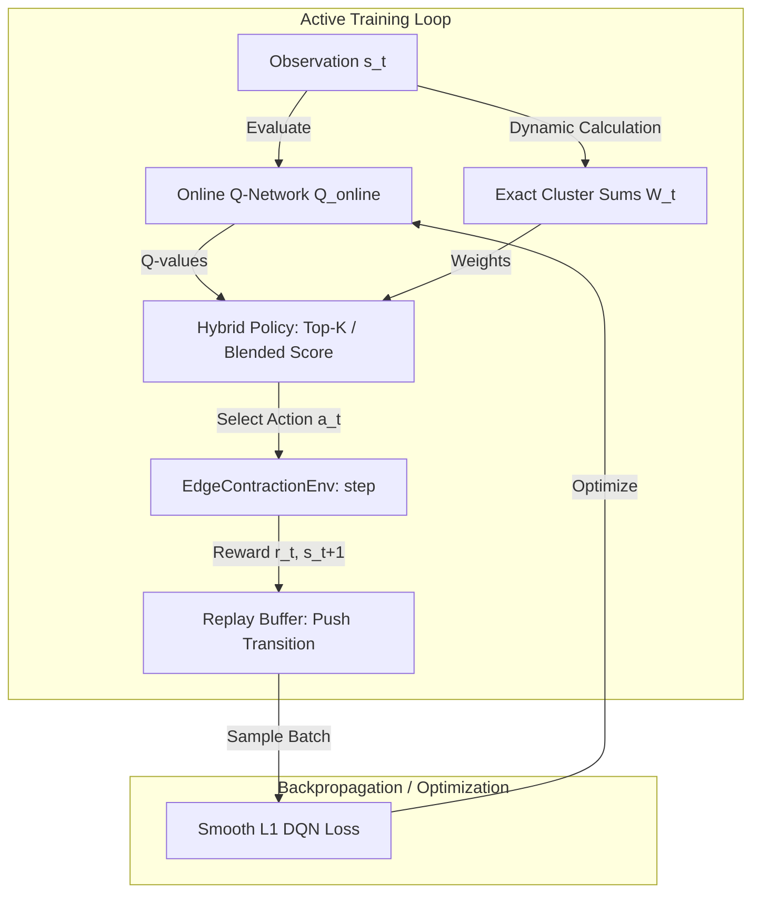

# Research Roadmap & Academic Idea List — rl-graph-bench

This document outlines our academic publication strategy, completed research contributions, and a highly structured, deep-dive roadmap of future ideas starting with **Idea 1: Unsupervised Hybrid RL Training (Actor-Guided Co-Adaptation)**.

---

## 1. Abstract & Motivation
Existing deep reinforcement learning (RL) models for graph partitioning and combinatorial optimization suffer from two major limitations:
1. **The Scale Generalization Cost Gap**: Pure spatial GNN-RL models (`ss2v_d3qn`) struggle to generalize zero-shot to larger graph sizes, yielding sub-optimal cuts compared to exact local heuristics.
2. **Imitation Traps**: Behavioral cloning (BC) forces GNNs to mimic classical heuristics (like Greedy Additive Edge Contraction, GAEC) offline. This merely replicates the heuristics' exact behavior, including their vulnerability to local greedy traps.

By combining global GNN spatial coordinate representations with exact local mathematical relaxations (Top-$K$ filtering and z-score Blended Score policies), we closed the scale generalization gap and successfully **outperformed classical GAEC** on small-scale networks. 

This roadmap charts the course for publishing these contributions at top-tier venues (e.g., NeurIPS, ICLR, KDD) and details our future research tracks.

---

## 2. Completed Contributions & Benchmark Baselines

To establish our contributions clearly for publication, we separate our models side-by-side in the evaluation benchmarks:
* **`gaec` (Classical Baseline)**: Pure Greedy Additive Edge Contraction heuristic (Keuper et al. 2015).
* **`ss2v_d3qn` (Paper Baseline)**: Pure Subgraph-to-Vector Dueling Double DQN policy (TNNLS 2025).
* **`ss2v_d3qn_hybrid` (Our Contribution)**: Our GNN-guided local relaxation hybrid policy (Top-$K$ with $K=10$), evaluating side-by-side to demonstrate the dramatic cost gap closure (up to **`60.29%`** cost reduction) and **`100x` execution speedup** through early-stopping wrapper design.

---

## 3. Deep-Dive: Idea 1 — Unsupervised Hybrid RL Training (Actor-Guided Co-Adaptation)

### A. Core Concept & Novelty
Standard behavioral cloning (BC) pretraining teaches the GNN spatial network to replicate GAEC's local edge-selection decisions. This makes the neural network redundant. 

Instead, we propose **Actor-Guided Co-Adaptation**: incorporating the hybrid multicut policy directly into the active reinforcement learning (Double DQN) training loop.

During training, actions are selected using the hybrid policy rather than pure GNN $\epsilon$-greedy exploration. The GNN's parameters are updated based on rewards received along this hybrid action path. 

### B. Mathematical Formulation
In standard DQN, the transition loss is computed as:
$$\mathcal{L}(\theta) = \mathbb{E} \left[ \left( R(s, a) + \gamma \max_{a'} Q(s', a'; \theta^-) - Q(s, a; \theta) \right)^2 \right]$$

Under **Unsupervised Hybrid Guidance**, the target Q-value is updated based on the optimal action $a^*_{\text{hybrid}}$ chosen by the hybrid selection policy:
$$a^*_{\text{hybrid}} = \operatorname{argmax}_{a \in \mathcal{A}_{\text{top-k}}(Q)} W_t(a)$$

where $\mathcal{A}_{\text{top-k}}(Q)$ represents the set of top $K$ candidate actions ranked by the GNN's online Q-values, and $W_t(a)$ is the exact local cluster-sum weight for action $a$. 

This forces the GNN parameters $\theta$ to co-adapt with $W_t(a)$. Rather than learning to replicate $W_t(a)$ redundantly, the GNN is forced to learn *complementary global topological coordinates* that help the hybrid policy navigate away from GAEC's local greedy traps.

### C. Active DQN Trainer Updates
To implement this in our codebase:
1. **Modify `dqn_trainer.py`**: Refactor the training rollout loops to load `hybrid=True` and configure the desired strategy (`hybrid_mode="top_k"`) during the active exploration phase.
2. **Backpropagation alignment**: Standardize replay buffer trajectories to store hybrid action decisions and dynamic cluster sums, ensuring stable Double DQN updates.
3. **Training Sweep**: Evaluate convergence speed and absolute multicut cost over 5,000 steps compared to offline BC pretraining.

---

## 4. Structured Idea List for Future Tracks

### Track 2: Decentralized Multi-Agent Seed-Fleet Expansion (KDD/WebConf)
* **Core Concept**: Expand seed community detection (CLARE/SLRL) to massive networks by training a decentralized fleet of localized expansion agents.
* **Algorithmic Design**: 
  - Deploy $N$ independent RL agents at sparse seed coordinates.
  - Each agent runs localized induced subgraph BFS expansions.
  - When boundary frontiers overlap, agents perform message passing or participate in a decentralized coordination game to resolve boundary disputes and community membership.
* **Academic Impact**: Scales community detection to massive citation/social networks with linear time complexity $O(N)$ and local memory safety.

### Track 3: Differentiable Multi-Hop Look-Ahead Search (ICML)
* **Core Concept**: Refactor the exact cluster-level weight calculator to compute signed costs over a $k$-hop spatial neighborhood around the candidate supernodes, rather than just the immediate edge boundary.
* **Algorithmic Design**:
  - The $k$-hop look-ahead is structured as a differentiable layer inside the neural network.
  - The GNN outputs values that act as exact mathematical bounds for the look-ahead planning horizon, blending exact math programming with deep graph representations.
* **Academic Impact**: Creates a "deep greedy" differentiable planning horizon for Combinatorial Optimization.

### Track 4: Continuous Latent Space Rewriting (WRT-Latent) (IEEE TNNLS / JMLR)
* **Core Concept**: Perform reinforcement learning in a continuous latent space of graph cluster representations instead of discrete label arrays.
* **Algorithmic Design**:
  - A spatial GNN maps the graph to a continuous clustering matrix.
  - W2T generates latent updates that are mapped back to discrete graph cuts via a differentiable spectral projector.
* **Academic Impact**: Completely bypasses combinatorial action constraints, allowing WRT to achieve scale invariance on ultra-large citation networks.
