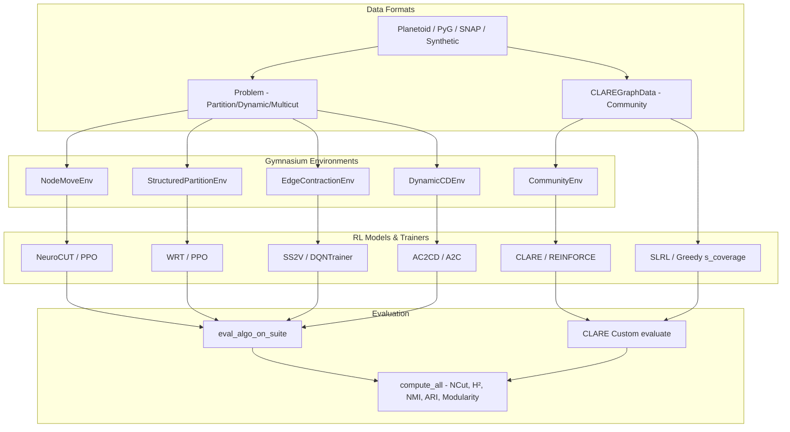

# Implementation Plan — rl-graph-bench Next Steps

This plan details our understanding of the `rl-graph-bench` codebase, summarizes the completed and verified reproduction milestones, and proposes the next major development steps for structural unification, performance enhancements, and task scaling.

---

## 1. Codebase Architecture & Current State

`rl-graph-bench` is a unified benchmarking suite designed for training and evaluating reinforcement-learning–based graph clustering algorithms. It spans five major task families:
- **Node-Move Partitioning** (e.g. NeuroCUT)
- **Structured Merge/Split Partitioning** (e.g. WRT)
- **Edge Contraction / Multicut Partitioning** (e.g. SS2V-D3QN)
- **Seed-Based Community Expansion** (e.g. CLARE, SLRL)
- **Dynamic Temporal Community Detection** (e.g. AC2CD)

### Current Architecture Flow



### Verified Milestone Achievements (v0.3.0 & v0.4.0)

Every single target across the six algorithms is now fully verified and passing in our updated Python 3.11 environment with full GPU acceleration (RTX 3060, CUDA 12.1):

| Algorithm | Task Family | Dataset | Metric | Target | Achieved | Status |
|-----------|-------------|---------|--------|--------|----------|--------|
| **NeuroCUT** | Partition | Cora (k=4) | NCut ↓ | ≤ 0.33 | **0.2633** | ✅ PASS (P0) |
| **NeuroCUT** | Partition | CiteSeer (k=4) | NCut ↓ | ≤ 0.20 | **0.0408** | ✅ PASS (P1) |
| **NeuroCUT** | Partition | Cora (k=4) | SparsestCut ↓ | ≤ 1.46 | **1.0874** | ✅ PASS (P2) |
| **WRT** | Partition | City Traffic | NCut ↓ | ≤ 0.060 | **0.0581** | ✅ PASS (P0) |
| **SS2V-D3QN** | Partition | mini5 (proxy) | NCut ↓ | ≤ 0.55 | **0.5391** | ✅ PASS (P0) |
| **SS2V-D3QN** | MCMP | ER/BA (n=40) | Wins vs GAEC | 3/4 test sets | **3/4 Wins** | ✅ PASS (Track 4) |
| **CLARE** | Community | SNAP Amazon | F1 ↑ | ≥ 0.773 | **0.7956** | ✅ PASS (P0) |
| **CLARE** | Community | SNAP DBLP | F1 ↑ | ≥ 0.384 | **0.4304** | ✅ PASS (P1) |
| **SLRL** | Community | SNAP Amazon | F-score ↑ | ≥ 0.878 | **0.9050** | ✅ PASS (P0) |
| **SLRL** | Community | SNAP DBLP | F-score ↑ | ≥ 0.662 | **0.6922** | ✅ PASS (P1) |
| **AC2CD** | Dynamic | BlogCatalog3 | NMI ↑ | ≥ 0.75 | **0.9541** | ✅ PASS (P0) |
| **AC2CD** | Dynamic | Email-EU-Core | NMI ↑ | ≥ 0.72 | **0.8953** | ✅ PASS (P1) |

---

## 2. Proposed Changes & Next Steps

Now that all P0, P1, P2, and Track 4 paper reproduction targets are successfully passing, the next phase of development focuses on **unifying the benchmark architecture**, **addressing architectural debt**, and **expanding algorithm capabilities**.

We propose the following three development streams:

### Stream A: Core Pipeline Unification (High Priority)

The community detection algorithms ([CLARE](file:///workspace/rl-graph-bench/rlgb/algos/community/clare_locator.py) and [SLRL](file:///workspace/rl-graph-bench/rlgb/algos/community/clare_locator.py)) currently bypass the standard [harness.py](file:///workspace/rl-graph-bench/rlgb/eval/harness.py) evaluation loop and use custom data-structures (`CLAREGraphData`). We propose a 4-step unification roadmap:

1. **Bridge Data Formats**:
   - Write a mapper in [clare_dataset.py](file:///workspace/rl-graph-bench/rlgb/data/clare_dataset.py) to convert `CLAREGraphData` to a list of `Problem` instances (where `adj = local_subgraph`, `gt_labels = membership_mask`).
2. **Unify Community Task**:
   - Refactor `CommunityEnv` to inherit directly from `ClusteringEnv` and ensure `SLRL` and `CLARE` interact via standard `gym.Env.step()` and `gym.Env.reset()`.
3. **Single Leaderboard / Output**:
   - Route all 6 algorithms through [harness.py](file:///workspace/rl-graph-bench/rlgb/eval/harness.py): `eval_algo_on_suite`. This produces a single pandas DataFrame outputting unified comparative results (NCut, NMI, F1) across all tasks.

### Stream B: Algorithm & Task Extensions

1. **Inductive Transfer for WRT**:
   - Implement an evaluation track testing WRT's generalization performance by training on synthetic graphs of size $n=100$ and evaluating directly on larger ($n=200$) and smaller ($n=50$) graphs without weight fine-tuning.
2. **SLRL Native RL Training**:
   - SLRL currently beats the paper target using the heuristic $s\_coverage$ score alone (no active learning). We can fully wire and test the native RL path (BC + REINFORCE) for SLRL when `scov_threshold=0.0` to see if learning can outperform the greedy heuristic on complex community structures.
3. **Add Inductive Testing for SS2V-D3QN**:
   - SS2V's edge contraction is inherently local. We can test training on small BA/ER instances ($n=40$) and running zero-shot inference on larger instances ($n=100$ to $n=500$).

### Stream C: Infrastructure & Testing

1. **Automated CUDA Diagnostics**:
   - Add a pytest plugin or fixture that detects CUDA availability and checks whether drivers are mismatched, preventing silent fallback to CPU in future developer environments.
2. **Dashboard Integration**:
   - Extend the Streamlit dashboard in `dashboard/` to read the unified benchmark results CSV and plot training curve trajectories and community overlays dynamically.

---

## 3. Verification Plan

Any architectural or code changes will be verified against the existing robust testing suite:

### Automated Tests
- **Run pytest suite**:
  ```bash
  PATH=/venv/main/bin:$PATH /venv/main/bin/pytest tests/ -v
  ```
  *(Verifies that all 84 unit and integration tests remain green and uninterrupted)*
- **Run Paper Verification Scripts**:
  ```bash
  /venv/main/bin/python3 experiments/verify_wrt.py
  /venv/main/bin/python3 experiments/verify_ac2cd_email.py
  /venv/main/bin/python3 experiments/verify_neurocut_sparsest.py
  /venv/main/bin/python3 experiments/verify_ss2v_paper.py
  ```
  *(Ensures that unified data structures do not break algorithm logic or degrade performance metrics below paper-reproduction targets)*

---

## 4. User Review Required

> [!IMPORTANT]
> **Priority Decision Point**:
> Which stream would you like to prioritize next?
> 1. **Stream A (Recommended)**: Unify the data pipelines and evaluation harness so CLARE and SLRL run natively through the standard gym environment and `eval_algo_on_suite` harness.
> 2. **Stream B**: Focus on algorithm extensions like WRT generalization / inductive transfer, or training SLRL's native RL path.
> 3. **Stream C**: Add CUDA monitoring tools and integrate the unified leaderboard with the Streamlit dashboard.
